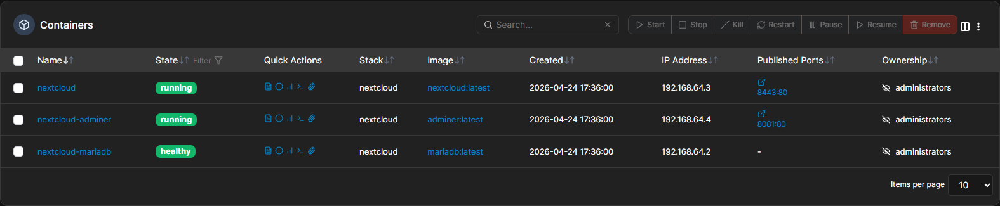

<h1 align="center">Nextcloud Docker</h1>

<p align="center">
  <a href="https://github.com/xamayca/nextcloud-docker/blob/master/LICENSE"></a>
  <a href="https://www.synology.com"></a>
  <a href="https://www.portainer.io"></a>
  <a href="https://hub.docker.com/_/nextcloud"></a>
  <a href="https://mariadb.org"></a>
  <a href="https://www.adminer.org"></a>
</p>

<p align="center">
  Self-hosted Nextcloud instance using Docker Compose with MariaDB and Adminer, deployed on a Synology NAS.
</p>



---

## 📋 Table of Contents

|     |                       Section                        |         Description         |
|:---:|:----------------------------------------------------:|:---------------------------:|
| ⚙️  |         **[PREREQUISITES](#-prerequisites)**         |    Software requirements    |
| 📁  |  **[REQUIRED DIRECTORIES](#-required-directories)**  | Host directories to create  |
| 🚀  |        **[STACK OVERVIEW](#-stack-overview)**        | Services, ports and network |
| 🔐  | **[ENVIRONMENT VARIABLES](#-environment-variables)** |   stack.env configuration   |
| 🚢  |  **[PORTAINER DEPLOYMENT](#-portainer-deployment)**  |    Deploy via Portainer     |
| 🗄️ | **[BACKUP](#-backup)** | Volumes to back up |    |
| 📄  |               **[LICENSE](#-license)**               |         MIT License         |

---

## ⚙️ Prerequisites

- 🐳 **Docker** installed on your host machine
- 🚢 **Portainer** (recommended for deployment via Git)
- 📁 **Access to your host machine** to create directories (via SSH or file manager)

---

## 📁 Required Directories

Create the following directories on your host before deploying:

```bash
mkdir -p /volume1/docker/nextcloud/custom_apps
mkdir -p /volume1/docker/nextcloud/config
mkdir -p /volume1/docker/nextcloud/data
mkdir -p /volume1/docker/nextcloud/themes
```

> [!NOTE]
> Paths above are configured for **Synology NAS**. Adjust the `NEXTCLOUD_HOST_*` variables in Portainer to match your host environment.

---

## 🚀 Stack Overview

Three services orchestrated via Docker Compose, communicating through a shared bridge network.

|   Service   |                         Image                          |      Container      | Container Port | Host Port |       Network       | Depends On |               Description               |
|:-----------:|:------------------------------------------------------:|:-------------------:|:--------------:|:---------:|:-------------------:|:----------:|:---------------------------------------:|
|  `mariadb`  |   [mariadb:latest](https://hub.docker.com/_/mariadb)   | `nextcloud-mariadb` |     `3306`     |     —     | `backend-nextcloud` |     —      |             Database server             |
|  `adminer`  |   [adminer:latest](https://hub.docker.com/_/adminer)   | `nextcloud-adminer` |     `8080`     |  `8081`   | `backend-nextcloud` | `mariadb`  |    Database administration interface    |
| `nextcloud` | [nextcloud:latest](https://hub.docker.com/_/nextcloud) |     `nextcloud`     |      `80`      |  `8443`   | `backend-nextcloud` | `mariadb`  | File hosting and collaboration platform |

> [!NOTE]
> The **Nextcloud image** includes an **Apache web server** — no separate web server container is needed.

---

## 🔐 Environment Variables

All variables must be provided via `stack.env` or manually in the Portainer stack environment section.

|             Variable             |                                        Description                                        | Required |
|:--------------------------------:|:-----------------------------------------------------------------------------------------:|:--------:|
|         `MYSQL_DATABASE`         |                                       Database name                                       |    ✅     |
|           `MYSQL_USER`           |                                     Database username                                     |    ✅     |
|         `MYSQL_PASSWORD`         |                                     Database password                                     |    ✅     |
|      `MYSQL_ROOT_PASSWORD`       |                                  Database root password                                   |    ✅     |
|      `NEXTCLOUD_ADMIN_USER`      |             Nextcloud admin username — _configuration still being evaluated_              |    ❌     |
|    `NEXTCLOUD_ADMIN_PASSWORD`    |             Nextcloud admin password — _configuration still being evaluated_              |    ❌     |
|   `NEXTCLOUD_TRUSTED_DOMAINS`    |         Allowed domains (space-separated) — _configuration still being evaluated_         |    ❌     |
|    `NEXTCLOUD_THEME_DIR_NAME`    |                              Nextcloud theme directory name                               |    ❌     |
|         `ADMINER_DESIGN`         | [Adminer UI theme](https://github.com/vrana/adminer/tree/master/designs) (e.g. `dracula`) |    ❌     |
| `NEXTCLOUD_HOST_CUSTOM_APPS_DIR` |                                 Host path for custom apps                                 |    ✅     |
|   `NEXTCLOUD_HOST_CONFIG_DIR`    |                                   Host path for config                                    |    ✅     |
|    `NEXTCLOUD_HOST_DATA_DIR`     |                                  Host path for user data                                  |    ✅     |
|   `NEXTCLOUD_HOST_THEMES_DIR`    |                                   Host path for themes                                    |    ✅     |

> [!TIP]
> If `NEXTCLOUD_ADMIN_USER` and `NEXTCLOUD_ADMIN_PASSWORD` are not set, the admin account will be created manually on first login.

---

## 🚢 Portainer Deployment

Deploy this stack via Portainer using the Git repository integration.

### Step 1 — Create the stack

- Open **Portainer** → **Stacks** → **Add stack**
- Select **Repository**
- Set the following fields:

| Field          | Value                                         |
|----------------|-----------------------------------------------|
| Repository URL | `https://github.com/xamayca/Nextcloud-docker` |
| Compose path   | `compose.yaml`                                |

### Step 2 — Enable automatic updates _(optional)_

Enable **GitOps updates** to automatically redeploy when changes are detected in the Git repository.

> [!WARNING]
> GitOps updates may override any manual configuration changes.

### Step 3 — Configure environment variables

**Option A — Import file**
Download `stack.env` from the repository and import it directly into Portainer.

**Option B — Manual setup**
Copy the variables into the **Advanced environment variables** section.

### Step 4 — Pre-deploy checklist

> [!IMPORTANT]
> Verify the following before deploying.

**Database** — required, MariaDB will not start without these
- [ ] `MYSQL_DATABASE`, `MYSQL_USER`, `MYSQL_PASSWORD`, `MYSQL_ROOT_PASSWORD` are all set

**Bind mount paths** — directories must exist on the host before deploying
- [ ] `NEXTCLOUD_HOST_CUSTOM_APPS_DIR` — e.g. `/path/to/nextcloud/custom_apps`
- [ ] `NEXTCLOUD_HOST_CONFIG_DIR` — e.g. `/path/to/nextcloud/config`
- [ ] `NEXTCLOUD_HOST_DATA_DIR` — e.g. `/path/to/nextcloud/data`
- [ ] `NEXTCLOUD_HOST_THEMES_DIR` — e.g. `/path/to/nextcloud/themes`

**Optional — review or leave empty**
- [ ] `NEXTCLOUD_ADMIN_USER` / `NEXTCLOUD_ADMIN_PASSWORD` — if not set, admin account must be created manually on first login
- [ ] `NEXTCLOUD_TRUSTED_DOMAINS` — defaults to `localhost`, set your host IP or domain to allow external access
- [ ] `NEXTCLOUD_THEME_DIR_NAME` — if not set, no custom theme is mounted
- [ ] `ADMINER_DESIGN` — if not set, defaults to the standard Adminer theme

### Step 5 — Deploy

Click **Deploy the stack**.

---

## 🗄️ Backup

This stack uses Docker volumes for persistent storage.

|     Volume     |     Type      |                        Host path                         |                Container path                |
|:--------------:|:-------------:|:--------------------------------------------------------:|:--------------------------------------------:|
| `mariadb_data` | Docker volume |                            —                             |               `/var/lib/mysql`               |
|     `html`     | Docker volume |                            —                             |               `/var/www/html`                |
|     `apps`     |  Bind mount   |         `/volume1/docker/nextcloud/custom_apps`          |         `/var/www/html/custom_apps`          |
|    `config`    |  Bind mount   |            `/volume1/docker/nextcloud/config`            |            `/var/www/html/config`            |
|     `data`     |  Bind mount   |             `/volume1/docker/nextcloud/data`             |             `/var/www/html/data`             |
|    `theme`     |  Bind mount   | `/volume1/docker/nextcloud/themes/<optional_theme_name>` | `/var/www/html/themes/<optional_theme_name>` |

> [!WARNING]
> This section is currently under review. Backup strategy may change in future updates.

---

## 📄 License

This project is licensed under the **MIT License** — see the [`LICENSE`](https://github.com/xamayca/Nextcloud-docker/blob/master/LICENSE) file for details.